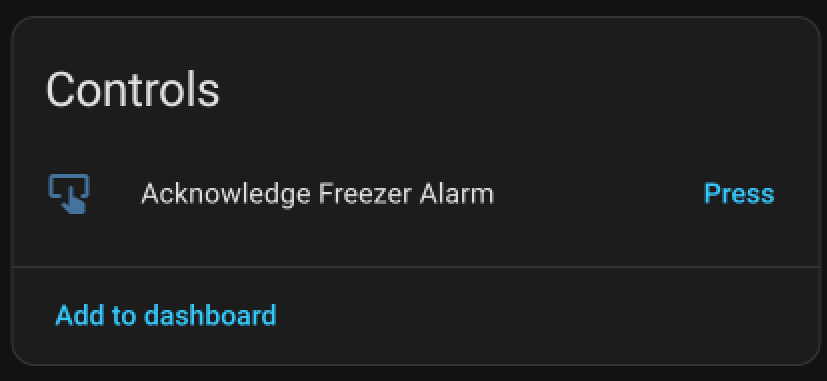
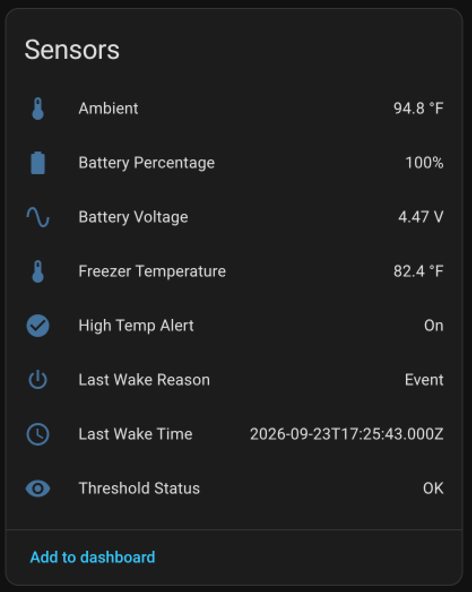
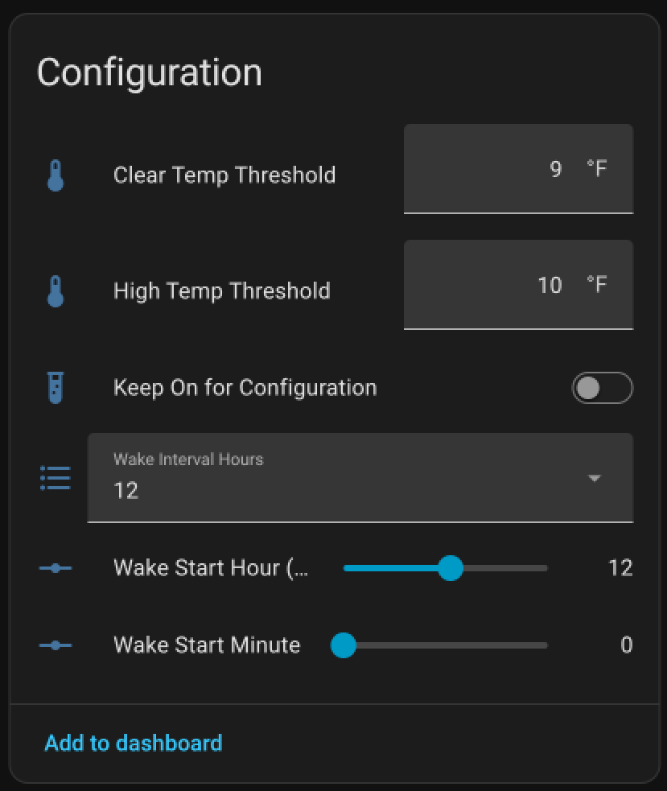

# Freezer Monitor

Battery-powered freezer monitor for Home Assistant and ESPHome. It continuously watches freezer temperature using a flat printed circuit sensor probe, wakes Home Assistant immediately for high-temperature events, and uses RTC-controlled power cycling for long battery life.

Setup Video: https://youtu.be/nzpPNruYSMk

Technical Video: https://youtu.be/-qzcmOnRHUw

Setting up Helpers and Notifcations: https://youtu.be/nKuBQElTua8

Etsy (purchase): https://www.etsy.com/listing/4555225886/freezer-monitor-for-home-assistant

## Requirements

- Home Assistant with the ESPHome add-on or integration installed.
- A 2.4 GHz Wi-Fi network.
- The supplied pre-flashed Freezer Monitor, FPC probe, and battery.
- Optional: Home Assistant Companion App for phone push notifications, or an existing Home Assistant email notification service for email alerts.

## Assemble and charge

1. Connect the temperature probe.
2. Connect the supplied battery.
3. Charge the battery through the USB port.
4. Continue with first-time setup below.

### Replacement battery safety

Use only a single-cell 3.7 V LiPo battery with a PH-style connector. Verify connector polarity before connecting a replacement battery. Reversed polarity can permanently damage the PCB.

## First-time setup

1. Power the freezer monitor via USB. It stays awake by default for configuration.
2. Provision Wi-Fi using either Bluetooth Improv or the `Freezer Monitor Setup` captive portal. Provisioning has a ten minute timeout. Power cycle the device to reopen the provisioning window if it expires. The fallback `Freezer Monitor Setup` Wi-Fi network is unsecured. Complete provisioning promptly and configure one unprovisioned monitor at a time.
3. Finish Home Assistant discovery and setup by going to **Settings → Devices & services** and adding the freezer monitor. Home Assistant assigns the device API encryption key during this process.
4. Go into the device settings and set alert thresholds and heartbeat schedule if desired.
5. Unplug from USB power and turn off **Keep On for Configuration** in the device controls. Normal low-power monitoring starts after the current wake period. Note: without an initial valid RTC time sync, normal shutdown cycles cannot start, and the device will not power itself off. Once an initial time sync happens, the RTC can maintain time even if it cannot sync every power cycle (such as when wifi is down), so this is only an issue at initial setup.

## How it works

The probe-side TMP102 sensor monitors freezer temperature continuously, even when the ESP32 is powered off. The RTC controls ESP32 power and records both scheduled wakes and temperature events.

| Term | Meaning |
| --- | --- |
| **Alarm** | A scheduled RTC heartbeat wake. Default: every 12 hours. |
| **Event / Alert** | A freezer temperature above **High Temp Threshold**. This wakes the ESP32 immediately. |
| | |

During a normal Alarm wake, the monitor powers on for about 12 seconds, updates Home Assistant with freezer and ambient temperature, battery voltage/percentage, Wi-Fi signal, and wake status, then the RTC cuts ESP32 power again.

The default heartbeat schedule is every 12 hours. **Wake Start Hour (UTC)** and **Wake Start Minute** determine the base heartbeat time; **Wake Interval Hours** selects interval length in between heartbeats. Wake times for the device are then derived from the selected time and interval settings. All schedule times are UTC. Adjust them manually when local-time or daylight-saving changes require it. Setting wake interval to 0 will wake the device once a day (every 24hrs).

The monitor must be awake and connected to Wi-Fi before Home Assistant can update the device settings. Normal wake windows are brief; enable **Keep On for Configuration** while making several changes, updating firmware, or adopting the device.

### Optional persistent Keep Awake helper

The device control **Keep On for Configuration** always remains available and works while the monitor is awake. For an optional control that remembers a request made while the monitor is powered off, create a Home Assistant **Toggle** helper named `Freezer Monitor Keep Awake`. Its entity ID must be `input_boolean.freezer_monitor_keep_awake`.

Use **Settings → Devices & services → Helpers → Create helper → Toggle**. The helper state is stored by Home Assistant. On the monitor's next successful connection to Home Assistant, its saved state is applied: on keeps the monitor awake; off resumes normal RTC power cycling. Using the device's existing **Keep On for Configuration** control also updates the helper when it exists.

You will also need to allow the device to perform actions for the helper to function. Navigate to **Settings → Devices & services → ESPHome** and find the device in the list. Click on the gear to access the options, and check the box for **Allow the device to perform Home Assistant actions.**

The helper cannot power on the monitor immediately and cannot apply its value during a wake where the monitor cannot connect to Home Assistant. Users who do not create the helper can continue using the device control normally during an awake period.

## Device controls and readings

| Home Assistant entity | Purpose |
| --- | --- |
| **CONTROLS**| |
| **Acknowledge Freezer Alarm** | Acknowledges a temperature event so normal power cycling can resume. |
| **Clear Temp Threshold** | Temperature the freezer must fall below before an alert can clear. Default: 9 °F. |
| **High Temp Threshold** | Temperature that triggers an Event/Alert. Default: 10 °F. |
|||

| Home Assistant entity | Purpose |
| --- | --- |
| **SENSORS**| |
| **Ambient** | Temperature at the main device PCB. This will not be accurate if the device is on for more than a brief time, as the ESP32 and other circuitry will rapidly heat the enclosure above true ambient temperatures. |
| **Battery Percentage** / **Battery Voltage** | Battery condition reported during an awake period. Percentage is an estimate from the configured LiPo voltage curve. Consider this approximate rather than precise. |
| **Freezer Temperature** | Temperature at the end of the probe. |
| **High Temp Alert** | On while the probe sensor reports a high-temperature condition. |
| **Last Wake Reason** / **Last Wake Time** | Last RTC wake cause and time. |
| **Threshold Status** | Reports threshold write or validation status. |
|||

| Home Assistant entity | Purpose |
| --- | --- |
| **CONFIGURATION**| |
| **Keep On for Configuration** | Keeps the monitor powered for setup, updates, and configuration. Turn it off for normal low-power operation. |
| **Wake Start Hour (UTC)** / **Wake Start Minute** / **Wake Interval Hours** | Heartbeat schedule controls. |
|  |  |

Home Assistant presents temperature sensors and threshold controls in its configured preferred temperature unit. Firmware defaults are 10 °F high and 9 °F clear; the device stores the underlying TMP102 limits in Celsius.

The clear threshold must be lower than the high threshold. The device rejects a high threshold below the clear threshold, or a clear threshold above the high threshold.

## Alerts and notifications

When freezer temperature rises above **High Temp Threshold**, the probe signals the RTC. The RTC creates an Event, turns on the ESP32, and Home Assistant receives the **High Temp Alert** state.

The monitor remains powered after an alert until both conditions are true:

1. Freezer temperature has fallen below **Clear Temp Threshold**.
2. You press **Acknowledge Freezer Alarm** in Home Assistant.

The monitor reports alert state to Home Assistant; it does not directly send push notifications or email. Create a Home Assistant automation to deliver notifications.

### Import the alert blueprint

The **Freezer Monitor Alerts** blueprint builds the automation for you. It sends the high temperature alert, repeats it until the freezer recovers, sends a recovery message, and can press **Acknowledge Freezer Alarm** on your behalf, so a monitor that has finished setup resumes power cycling on its own. Low battery and missed heartbeat alerts are included and are off by default.

1. Click the badge above. If it does not open, copy `https://github.com/techdregs/Freezer_Monitor/blob/main/Blueprints/freezer_monitor_alerts.yaml` into **Settings → Automations & Scenes → Blueprints → Import Blueprint**.
2. Click **Create Automation** on the imported blueprint.
3. Pick the five Freezer Monitor entities it asks for: High Temp Alert, Freezer Temperature, Acknowledge Freezer Alarm, Battery Percentage, and Last Wake Time.
4. Under **When the freezer is too warm**, replace the default Home Assistant notification with your Companion App notify action for phone push, or your configured email notify action.
5. Save.

The blueprint re-sends the alert every 15 minutes until the freezer drops below **Clear Temp Threshold**. Set the repeat interval to 0 to alert only once.

To turn on the extra alerts, open the collapsed sections and raise their thresholds above 0. **Low battery alert** fires when Battery Percentage drops below the value you pick. **Missed heartbeat alert** fires when **Last Wake Time** has not changed for longer than you allow, which catches a flat battery, a Wi-Fi outage, or a monitor that has stopped waking. Set it comfortably longer than your **Wake Interval Hours**, for example 26 hours on the default 12 hour heartbeat. Restarting Home Assistant restarts that clock.

### Build the automation yourself

The blueprint is optional. To wire it up by hand:

1. In Home Assistant, open **Settings → Automations & Scenes → Create Automation**.
2. Create a new empty automation and add a **State** trigger.
3. Select this monitor **High Temp Alert** entity and set **To** to `on`.
4. Add an action:
   - For phone push, choose the notification service for the Home Assistant Companion App on your phone.
   - For email, choose your already configured Home Assistant email notification service.
5. Add a title and message, such as `Freezer temperature alert` and `Check the freezer monitor.` Save the automation.

Optional: create a second automation triggered when **High Temp Alert** changes to `off` to send a recovery notification.

## Updating and advanced ESPHome use

The pre-flashed firmware is intended to work without YAML edits. Advanced ESPHome users can adopt the device from the ESPHome dashboard:

1. Wait for the device to wake, then enable **Keep On for Configuration**.
2. Use ESPHome dashboard adoption. The dashboard import downloads the full local YAML configuration.
3. Edit or update as needed, then compile and install firmware.
4. Turn off **Keep On for Configuration** to resume low-power operation.

Compiling the adopted YAML requires Internet access from the ESPHome host. It downloads the external TMP102 and RX8XXX ESPHome components referenced in the configuration.

Serial logs are disabled in the shipped firmware (`logger.baud_rate: 0`) to reduce power use.

## Errata

There is a silkscreen error on the back of the PCB for the probe pins. This will not affect the device use unless you wish to make your own probe.

## Project files

- [ESPHome YAML](YAML/Freezer_Monitor.yaml)
- [Freezer Monitor Alerts blueprint](Blueprints/freezer_monitor_alerts.yaml)
- Schematics: [main PCB](Schematics/Freezer%20Monitor%200.5.pdf), [flat probe cable](Schematics/Flat_NTC.pdf), and [KiCad FPC footprint](Schematics/FPC_Footprint/FPC8_1.0mm.kicad_mod)
- Datasheets: [ESP32-C3-MINI-1](Datasheets/esp32-c3-mini-1_datasheet_en.pdf), [RX8111CE RTC](Datasheets/RX8111CE_en.pdf), and [TMP102](Datasheets/TMP102_UMW.pdf)
- Enclosure models: [housing](Enclosure/Freezer%20Monitor%20v0.5%20Enclosure-Housing.3mf), [lid](Enclosure/Freezer%20Monitor%20v0.5%20Enclosure-Lid.3mf), and [complete enclosure STEP](Enclosure/Freezer%20Monitor%20v0.5%20Enclosure.step)
- PCB/probe models: [PCB STEP](PCB%20Models/Freezer%20Monitor%20PCB%20v0.5.step) and [flat probe STEP](PCB%20Models/Flat_Probe.step)

Schematics and models are supplied for reference and custom enclosure design. 

## Troubleshooting

| Problem | Check |
| --- | --- |
| Device remains on after disabling Keep On | Confirm it has received Home Assistant time synchronization. The monitor cannot schedule its first normal power cut until RTC time is valid. |
| A setting does not change | The monitor was likely powered off. Wait for an awake period or enable **Keep On for Configuration**. |
| No phone/email alert | Confirm **High Temp Alert** changes to `on` and that the Home Assistant automation and notification service work. |
| Cannot use serial logs | Shipped firmware intentionally disables serial logging. Use ESPHome logs/API while the device is awake, or customize YAML after adoption. |
